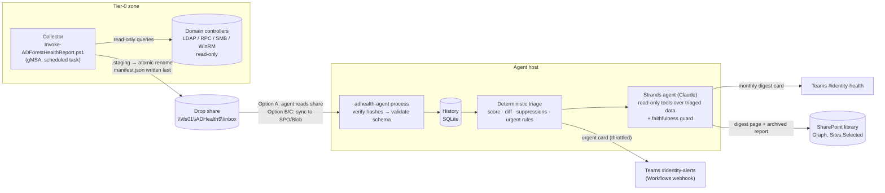

# Architecture & design brainstorm — AD Forest Health pipeline

> Scope label: **AD Core** (AD DS, LDAP, replication, trusts, Kerberos, DNS, SYSVOL). MDI / Entra ID / Conditional Access are roadmap modules (§8).

## 1. Outcome we are building toward

| Success criterion | How it is met |
|---|---|
| A **safe** monthly forest health report anyone can run | Collector is read-only by construction (no `Set-*`/`New-*`/`Remove-*` against AD, DNS, GPO, registry or services). It writes files only under `-OutputPath`. |
| **Super detailed** but still readable | 26 checks (one runs 13 LDAP hygiene rules) in 14 families, HTML executive summary on top with evidence and raw output at the bottom; CSV/JSON for machines. |
| **Urgent** issues reach people within hours, not at month end | Daily low-load run + deterministic urgent rules → Teams urgent channel, throttled. |
| **Monthly hygiene narrative** with month-over-month trend | Agent keeps history (SQLite), diffs against last month's *full* report, writes a digest to SharePoint and posts a Teams card. |
| No silent failure | Collection gaps become findings. No report for 35 days is its own alert. Rejected or tampered bundles raise an alert. |
| Nothing a human cannot verify | Every finding carries `checkId`, target, evidence reference, and the exact query in `checks[].command`. The LLM text is checked against the data before it is published. |

## 1a. Decisions of record

| # | Decision | Chosen | Why | Revisit when |
|---|---|---|---|---|
| D1 | Transport from the share to the agent | **Option A: the agent reads the share directly** (§3.2). No intermediate push | Fewest hops, no cloud copy of Tier-0 data, nothing extra to fail silently. Hash verification covers integrity. With Bedrock, only the sanitized narrative context leaves the network, never the bundle | The agent moves into AWS (natural next step with a Bedrock golden path), or more than one forest feeds it → push bundles to S3 (Option C, S3 instead of Blob) |
| D2 | LLM for the monthly narrative | **Claude on Amazon Bedrock via Strands (golden path).** Explicit approved model/inference-profile ID and region, optional PrivateLink endpoint and Bedrock Guardrail. No other LLM provider exists in the code | Mandated golden path. The data stays in your AWS account/region under your IAM, CloudTrail and guardrails. Only sanitized counts, titles and targets are sent (no account names). Any model error falls back to the template | Never for provider. `provider: none` if AI is ever disallowed |
| D3 | Agent host | Dedicated Windows VM, own read-only gMSA, scheduled tasks (`deploy/Register-ADHealthAgentTask.ps1`) | Native SMB access with Kerberos, same ops model as the collector | Moving to a container platform |

## 2. End-to-end flow

**Why the split matters:** everything that can page someone (`triage.py`) is plain, unit-tested code. The LLM only writes prose over data that has already been triaged. It cannot change what is urgent. It never sees account names, and it has no tool that reaches AD, the file system or the network.

## 3. Component decisions (with alternatives)

### 3.1 Collector (PowerShell 5.1/7, RSAT)
* **Where it runs:** a dedicated, hardened **Tier-0 jump/management host**. It reads the whole directory, including the attack-path findings (kerberoastable accounts, unconstrained delegation). Treat the host, the gMSA and the output share as Tier-0 assets. Do **not** run it on a DC. That adds load and concentrates risk on the DC.
* **Identity:** a **gMSA**, which has no stored password and rotates automatically. Rights needed per check family:

| Family | Minimum right | If missing |
|---|---|---|
| LDAP checks (topology, FSMO, hygiene, privileged, trusts, sites, backup metadata) | Authenticated Users (default read) | — |
| LAPS coverage | Read of `msLAPS-PasswordExpirationTime` (not the password) | Low-confidence finding; noted in recommendation |
| `repadmin`, `dcdiag`, `nltest /sc_query`, `w32tm /query` | Domain user (some dcdiag tests need more) | Check becomes `Partial` → collection gap finding |
| Event logs (`Get-WinEvent -ComputerName`) | **Event Log Readers** on DCs (builtin group, domain-wide) | `Partial` |
| CIM (services, disk, uptime, DFSR state) | WinRM + **Remote Management Users**, and DFSR WMI namespace read (often needs admin) | `Partial`, or use `-SkipRemoteCim` |

  Do **not** add the gMSA to Domain Admins to make the gaps go away. A gap is visible and honest. A DA-privileged scheduled task is a Tier-0 credential sitting on a jump host.
* **Two schedules:** **Monthly full** (1st, 02:00) is the trend baseline. **Daily light** (`-SkipHygiene -SkipDcDiag`) is for fast urgent detection: replication, time, SYSVOL, DNS, backup, event IDs. Only *full* runs become month-over-month baselines (`Report.is_full_run`).
* **Load management:** paged LDAP (1000/page), attribute minimization, one ADWS-discovered DC per domain for LDAP (recorded as *server affinity* in the report). Per-DC calls run sequentially with timeouts. Heavy families have skip switches. `-MaxRuntimeMinutes` raises a finding when the run exceeds its budget. Pilot with `-DomainController` first.
* **Hand-off contract:** the bundle is built in `.staging\`, renamed atomically into the inbox, and `manifest.json` (SHA-256 of every file) is written **last**. Consumers only read folders that contain a manifest. This removes the classic "the agent read half a file" failure.

### 3.2 Hand-off from the share: three options

| Option | How | Pros | Cons | Use when |
|---|---|---|---|---|
| **A. Agent reads the share** (**chosen**, D1) | Agent runs on an on-prem Windows/Linux VM with read access to the share | Simplest. No cloud copy of Tier-0 data. No extra moving parts | Agent host joins the Tier-0 blast radius | Pilot and phase 1 |
| B. Power Automate + on-prem data gateway | Flow copies new folders to an SPO library; agent reads from SPO | No inbound firewall rules. Low-code | Gateway is another Tier-0-adjacent box. Flow file-size limits. Harder to test | You already run the gateway |
| C. AzCopy / Blob + Event Grid | Collector host runs `azcopy` with a managed identity or scoped SAS to a private container; a queue-triggered Container Apps Job runs the agent | Event-driven. Scales to many forests. Good audit trail | More infra. Egress of Tier-0 data to cloud storage (encrypt, private endpoint) | Multi-forest, or the agent is hosted in Azure |

Whatever the transport, the agent **re-verifies the manifest hashes**. A partial or tampered copy is rejected and alerted, never half-processed.

> Integrity ≠ authenticity. Someone with write access to the share can edit a file *and* re-hash the manifest. If that is in your threat model, sign `manifest.json` (Authenticode via `Set-AuthenticodeSignature` with a code-signing cert on the collector host, or an HMAC key protected by DPAPI) and verify the signature in `ingest.py`. This is on the roadmap.

### 3.3 Agent (Python, Strands Agents + Claude)
* **Deterministic core:** `ingest` → `history` → `triage`. Pure functions, 40 tests, no network.
* **LLM narrative:** `narrative.StrandsNarrator` builds a Strands `Agent` with five read-only tools (`get_overview`, `list_findings`, `list_resolved_findings`, `get_metric_trends`, `get_metric_history`). The model is **Claude on Amazon Bedrock** (Strands `BedrockModel`, Converse API). `model_id` and `bedrock_region` are required and validated. The agent refuses to fall back to Strands' built-in default, which is a *global* cross-region profile. PrivateLink (`bedrock_endpoint_url`) and Bedrock Guardrails (`bedrock_guardrail_id/version`) pass straight through. AWS credentials come from the standard chain: IAM Roles Anywhere on the on-prem host, a task role in AWS. Least-privilege IAM: `deploy/bedrock-invoke-policy.example.json`. `llm.provider: none` gives the same digest from a template, so the pipeline works without an LLM.
* **Faithfulness guard** (`validate_narrative`): the model's text is rejected, and the template used instead, if it cites a check ID not in the report, omits any check with an active Critical finding, or drops a required section. The digest card says which narrative source was used.
* **Prompt-injection posture:** directory-sourced strings (names, event text, error messages) are data. They are control-stripped and length-capped (`sanitize.py`), account names are removed, the system prompt marks tool output as data, and the tools cannot act on anything. The worst outcome of a successful injection is a bad paragraph, which the guard usually catches, and never an action.
* **Where it runs:** start on the same management VM as a Windows scheduled task or systemd timer (`process` every hour after the collector windows, `digest` on the 2nd of the month). Later, a container (Azure Container Apps Job / AWS ECS scheduled task) with a managed identity.

### 3.4 Channels
* **Teams:** use a **Workflows** webhook ("When a Teams webhook request is received" → post card to channel). Classic Office 365 connector webhooks are retired. Use two webhooks and two channels: `#identity-alerts` (urgent, throttled per finding every 7 days) and `#identity-health` (monthly digest). Cards carry counts, titles and targets only, never account names. The webhook URL is a bearer secret and lives in an environment variable.
* **SharePoint:** Graph app-only with **Sites.Selected**, granted `write` on one site only, with a certificate credential. The agent archives `report.html/json/findings.csv` per month and publishes the digest page plus its Markdown. Library permissions should match the data classification (the report is sensitive).
* **Later:** ServiceNow/Jira ticket per new Critical/High, Power BI over the SQLite/SQL history, Teams bot for "ask the report" questions.

## 4. What is "urgent" (policy.yaml)

| Rule | Default | Why |
|---|---|---|
| Any active **Critical** | on | USN rollback, lingering objects, replication stalled ≥ ½ TSL, DC unreachable, SYSVOL down, FSMO holder down, no backup |
| **New or escalated High** in Replication, DCHealth, SYSVOL, Backup, FSMO, Time, DNS, Collector | on | Operational breakage that grows. Persisting Highs go to the monthly digest, not the pager |
| Coverage < 80% | on | The run was mostly blind |
| Score drops ≥ 15 points vs last full report | on | Broad deterioration with no single Critical |
| No report for > 35 days | on | Silence is a signal |
| Re-alert throttle | 7 days per finding key | Alert fatigue kills pipelines |
| **Suppressions** (accepted risk with owner and expiry) | empty | Hygiene exceptions without hiding risk. Critical can never be suppressed, expired entries are flagged, and the score still counts suppressed findings |

## 5. Health score
`100 − Σ_per-check min(25, Σ weights)` with weights Critical 20 / High 8 / Medium 3 / Low 1. The per-check cap stops one noisy check (e.g. 40 DCs logging the same event) from zeroing the score by itself. The same function is implemented in PowerShell and Python, and a test asserts they agree. Status: Red if any Critical, Amber if any High, else Green. The score is for trend, and status is what people act on.

## 6. Check catalog (v1.0)

| ID | Family | What (read-only) | Key thresholds |
|---|---|---|---|
| FOREST-001 | Forest | FFL, Recycle Bin, tombstone lifetime | RB off → Medium; TSL < 180 → Low |
| DC-001 | DCHealth | TCP 389/88/445/135/53/5985 (+3268 GC) | LDAP closed → Critical; other core → High |
| DC-002 | DCHealth | RootDSE bind, `isSynchronized`, clock sample | bind fail → Critical |
| TIME-001 | Time | Offset vs forest-root PDC | ≥ 60 s High; ≥ 240 s Critical |
| TIME-002 | Time | Root PDC `w32tm /query /source` | Local CMOS / free-running → High |
| FSMO-001 | FSMO | Holders exist, not deleted, reachable | unreachable → Critical |
| DC-003 | DCHealth | DC OS lifecycle | ≤ 2012 R2 High; 2016 Medium |
| DC-004 | DCHealth | Services, disk, uptime (CIM) | core service stopped Critical; < 10% disk High |
| REPL-001 | Replication | Partner metadata lag / consecutive failures | ≥ 24 h High; ≥ ½ TSL Critical |
| REPL-002 | Replication | Replication failure records | 8606/8614 Critical, others High |
| REPL-003 | Replication | `repadmin /showrepl /csv` cross-check + `/replsummary` | native says failing but cmdlets don't → High (conflicting signals) |
| SYSVOL-001 | SYSVOL | FRS vs DFSR (`msDFSR-Flags`) | not eliminated → High |
| SYSVOL-002 | SYSVOL | `\\dc\SYSVOL`, `\\dc\NETLOGON`, DFSR folder state | share missing / In Error → Critical |
| DNS-001 | DNS | `_ldap._tcp.dc._msdcs`, PDC, `_gc` SRV vs inventory | missing/stale → High |
| DNS-002 | DNS | Same query against each DC's DNS server | inconsistency → Medium |
| BACKUP-001 | Backup | `dSASignature` metadata per NC | ≥ 7 d High; ≥ ½ TSL Critical |
| DCDIAG-001 | DCHealth | `dcdiag /s:<dc> /skip:SystemLog` | core test failed → High |
| EVT-001 | EventLogs | 32 curated event IDs (DS, DFSR, System) | per-ID severity (2095 USN rollback = Critical) |
| TRUST-001 | Trusts | SID filtering, TGT delegation, AES, `nltest /sc_query` | no quarantine / TGT deleg → High |
| SITE-001 | Sites | Sites w/o subnets, orphan subnets, degenerate links | Low |
| KRB-001 | Kerberos | krbtgt and RODC krbtgt_* age | > 180 d Medium; > 365 d High |
| PRIV-001 | PrivilegedAccess | Protected group membership by SID (nested, IN_CHAIN) | DA/EA > 10, Schema Admins non-empty, operator groups → Medium |
| PRIV-002 | PrivilegedAccess | adminCount=1 hygiene, RID 500 age, Guest | SPN on admin / never-expires / Guest → High |
| HYG-000 | Hygiene | Default password policy, lockout, MAQ | MAQ > 0 Medium |
| HYG-001…013 | Hygiene | Stale, PNE, PASSWD_NOTREQD, AS-REP, kerberoastable, unconstrained/T2A4D delegation, reversible, DES, sIDHistory, legacy OS, Win10 | see `$script:HygieneRules` |
| HYG-014 | Hygiene | LAPS (Windows/legacy) coverage | schema absent → High |
| COLLECT-001/002 | Collector | Check errored/partial; runtime budget | Error → High |

## 7. Threat model (short)

| Risk | Mitigation in this design | Residual / next step |
|---|---|---|
| The report is an attacker's map (kerberoastable, delegation, stale admins) | Tier-0 share ACLs (gMSA write, agent read, admins read). `-RedactNames` available. Names never go to Teams or the LLM | Retention policy on share and SPO library. Sensitivity label on the library |
| Collector host compromise | gMSA, no DA, read-only code, code in version control with PR review | AppLocker/WDAC to allow only the signed collector script |
| Bundle tampering in transit | SHA-256 manifest verified; reject + alert | Signed manifest (§3.2) |
| Webhook URL leak → spoofed alerts | Env-var secret, never logged; urllib3 logs quieted | Rotate the Workflow URL; restrict who can edit the flow |
| Prompt injection via directory data | Data-only tools, sanitization, no names, faithfulness guard, LLM optional | Monitor `narrative source=deterministic` rates |
| LLM data egress | Counts, titles and targets only. Bedrock-only (no other provider in the code), explicit region, optional PrivateLink and Guardrail, CloudTrail logging of model invocations. `provider: none` | Data-processing review with privacy/security |
| Alert fatigue | Throttle, new-or-escalated rule for Highs, suppressions with expiry | Tune thresholds after 2–3 months of history |

## 8. Brainstorm: where this can go next (ranked by value / effort)

1. **Signed manifests + authenticity check** (small). Closes the tampering gap.
2. **GPO health module**: AD vs SYSVOL version mismatch, unlinked/empty GPOs, GPOs with broken permissions. Needs the `GroupPolicy` module (RSAT, first-party).
3. **LDAP signing / channel binding readiness**: aggregate 2887/2889 counts per client IP to size the enforcement project.
4. **AD CS module**: template flags risky for ESC1/ESC2/ESC4-style abuse, CA health, expiring CA certs, using `certutil` and LDAP reads only (no third-party modules unless approved).
5. **MDI module**: sensor health and open health alerts via Microsoft Graph security API (read-only app permission).
6. **Entra ID / Conditional Access module**: Entra Connect sync freshness, break-glass accounts excluded from CA, legacy auth sign-ins, stale guest accounts (Graph read-only).
7. **Ticketing**: one ServiceNow incident per new Critical, and a change *draft* (never auto-remediation) for High hygiene items.
8. **Trend dashboard**: Power BI over the history DB, or push the metrics to Log Analytics.
9. **"Ask the report" Teams bot**: the same Strands tools served behind a bot for questions like "which DCs failed replication last month?"
10. **Multi-forest**: one collector per forest, same inbox; history is already keyed by forest.

Remediation stays out of scope on purpose. The pipeline detects and explains. People make changes, through change control.
